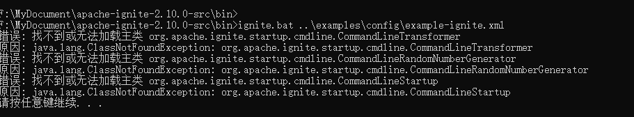
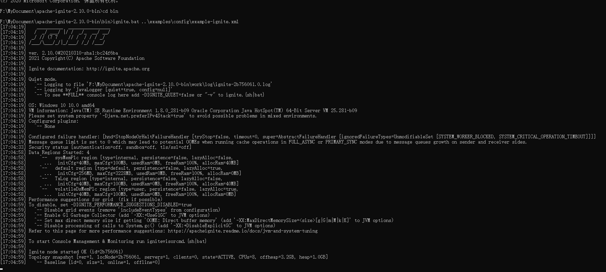
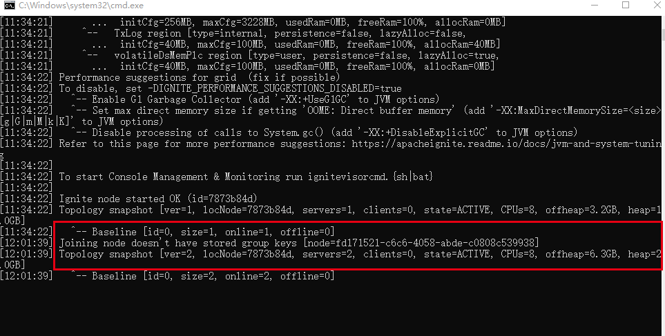
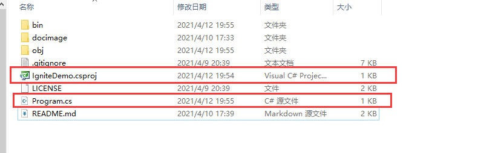
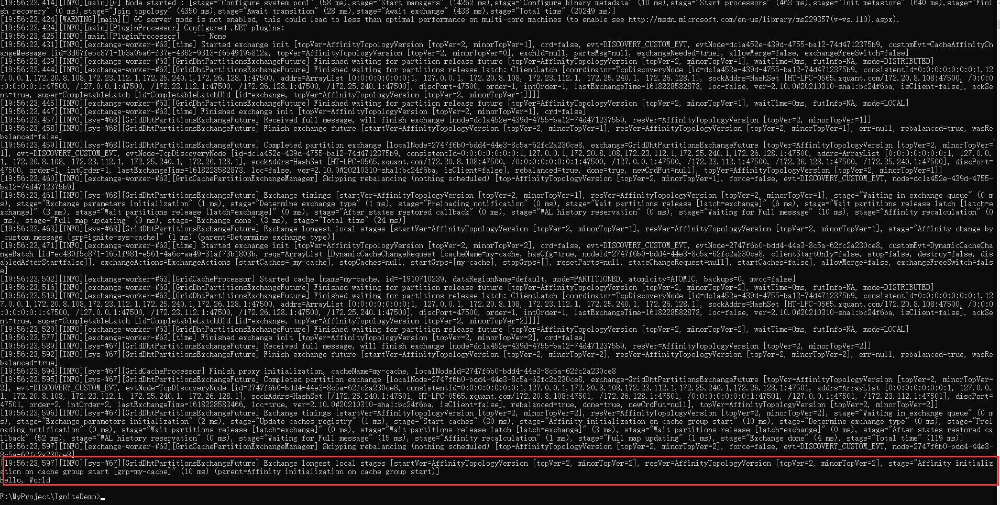

# IgniteDemo
>ignite的学习历程  示例代码参考官方给的example

### 环境准备
#### 环境要求

1. 安装[jdk8](https://www.oracle.com/java/technologies/javase/javase-jdk8-downloads.html) 或以上，并配置环境变量JAVA_HOME

2. 下载[ignite](https://ignite.apache.org/download.cgi#binaries)
**注意：如果下载SOURCE RELEASES 版本，需要自行编译，否则会出现如下错误。**

这里下载的是BINARY RELEASES版。

3. 配置IGNITE_HOME环境变量
**不要以\结尾，如：F:\MyDocument\apache-ignite-2.10.0-bin**

#### 开启ignite服务
进入ignite的bin目录，并执行如下命令
```shell
ignite.bat ..\examples\config\example-ignite.xml
```
如下所示，即表示服务已经开启


日志信息：
1. “ver=1”代表Ignite集群topology版本是1
2. “servers=1”代表现在集群里面就一个server节点，“clients=0”代表集群里没有client节点。可以简单的理解为server节点总是存放数据，client节点不存放数据，数据的访问总是通过server节点。
3. “CPUs=8”代表当前节点的CPU数量
4. “offheap=3.2GB”代表当前节点可以使用的Java堆外内存是3.2GB。Ignite用堆外来存储数据和索引来减少GC。默认配置下Ignite能使用的堆外内存为节点内存大小的20%。
5. “heap=1.0GB”是Ignite能使用的Java堆内存。

当我在本机再启动一个ignite实例，新的实例启动后，新老节点会互相发现并自动形成一个集群。如下是我启动一个新的ignite实例后，原有ignite实例启动窗口的信息ver, servers, offheap, heap值都改变了：



### 一个简单的.NET示例

#### 项目创建
分别执行如下命令
```shell
dotnet new console
```
会创建一个新的工程，包含了一个带有元数据的项目文件和有代码的.cs文件。

```shell
dotnet add package Apache.Ignite
```
添加Apache.Ignite的依赖



修改Program.cs
```C#
using System;
using Apache.Ignite.Core;

namespace IgniteDemo
{
    class Program
    {
        static void Main(string[] args)
        {
          var ignite = Ignition.Start();
          var cache = ignite.GetOrCreateCache<int, string>("my-cache");
          cache.Put(1, "Hello, World");
          Console.WriteLine(cache.Get(1));
        }
    }
}

```
启动项目
```shell
dotnet run
```

显示启动了一个节点，并输出‘Hello, World’。


### .NET项目使用ignite示例

#### 启动服务节点

##### 服务配置

###### xml配置
app.config
```xml
<?xml version="1.0" encoding="utf-8" ?>
<configuration>
  <configSections>
    <section name="igniteConfiguration" type="Apache.Ignite.Core.IgniteConfigurationSection, Apache.Ignite.Core" />
  </configSections>

  <runtime>
    <gcServer enabled="true" />
  </runtime>
  
  <igniteConfiguration xmlns="http://ignite.apache.org/schema/dotnet/IgniteConfigurationSection"
                         localhost="127.0.0.1" peerAssemblyLoadingMode="CurrentAppDomain">
    <atomicConfiguration atomicSequenceReserveSize="10" />

    <discoverySpi type="TcpDiscoverySpi">
      <ipFinder type="TcpDiscoveryMulticastIpFinder">
        <endpoints>
          <string>127.0.0.1:47500..47502</string>
        </endpoints>
      </ipFinder>
    </discoverySpi>
  </igniteConfiguration>
</configuration>
```

服务启动：
```C#
using var ignite = Ignition.StartFromApplicationConfiguration()
```

###### 自行配置
```C#
private static readonly IgniteConfiguration igniteConfiguration = new IgniteConfiguration
        {
            Localhost = "127.0.0.1",
            DiscoverySpi = new TcpDiscoverySpi
            { 
                IpFinder = new TcpDiscoveryMulticastIpFinder
                { 
                    Endpoints = new[]
                    {
                        "127.0.0.1:47500..47502"
                    }
                }
            },
            JvmOptions = new[]
            {
                "-DIGNITE_QUIET=true",
                "-DIGNITE_PERFORMANCE_SUGGESTIONS_DISABLED=true"
            },
            Logger = new ConsoleLogger
            { 
                MinLevel = LogLevel.Error
            },
            PeerAssemblyLoadingMode = Apache.Ignite.Core.Deployment.PeerAssemblyLoadingMode.CurrentAppDomain
        };
```

服务启动：
```C#
using var ignite = Ignition.Start(igniteConfiguration)
```

如果启动失败，有可能的原因：
1. 同一主机上已经使用不同的配置文件开启了ignite服务
2. 如果是使用xml配置文件，配置文件不对


